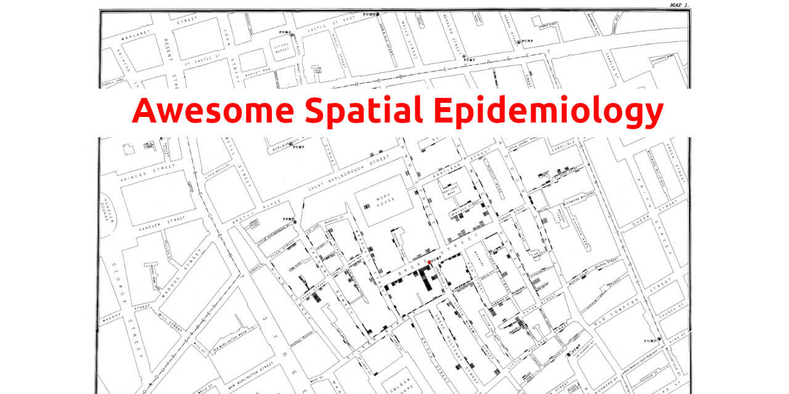

# Awesome Spatial Epidemiology


**Curated list of awesome spatial epidemiology data exchange concepts, data reference and tooling. Contributions are welcomed!**


## GitHub topics
> **Resoning behind 3 tiers**: Tier 1 is directly related to main topic of our list of recommendations.
> Tier 2 is is related to the scientific area (but not strictly the tooling).
> Tier 3 are related to the tooling (but not restricted to the scientific application).

- **Tier 1**:
  - [disease-mapping](https://github.com/topics/3): 3 repositories
  - [epidemic-simulations](https://github.com/topics/75): 75 repositories
  - [spatial-epidemiology](https://github.com/topics/4): 4 repositories
- **Tier 2**:
  - [bioinformatics](https://github.com/topics/6942): 6942 repositories
  - [epidemiology](https://github.com/topics/578): 578 repositories
  - [genomics](https://github.com/topics/1869): 1869 repositories
  - [infectious-diseases](https://github.com/topics/94): 94 repositories
- **Tier 3**:
  - [spatial-analysis](https://github.com/topics/470): 470 repositories
  - [geospatial-analysis](https://github.com/topics/227): 227 repositories

## General concepts

### [disease diffusion mapping (Q5282121)](https://www.wikidata.org/wiki/Q5282121)
Disease diffusion occurs when a disease is transmitted to a new location. It implies that a disease spreads, or pours out, from a central source.

### [disease ecology (Q60703450)](https://www.wikidata.org/wiki/Q60703450)
Disease ecology is a sub-discipline of ecology concerned with the mechanisms, patterns, and effects of host-pathogen interactions, particularly those of infectious diseases

### [health geography (Q3286542)](https://www.wikidata.org/wiki/Q3286542)
Health geography is the application of geographical information, perspectives, and methods to the study of health, disease, and health care.

### [reverse zoonosis (Q1049711)](https://www.wikidata.org/wiki/Q1049711)
A reverse zoonosis, also known as a zooanthroponosis (Greek zoon "animal", anthropos "man", nosos "disease") or anthroponosis, is a pathogen reservoired in humans that is capable of being transmitted to non-human animals.

### [spatial epidemiology (Q7574064)](https://www.wikidata.org/wiki/Q7574064)
Spatial epidemiology is a subfield of epidemiology focused on the study of the spatial distribution of health outcomes; it is closely related to health geography.

### [synthetic data (Q7662746)](https://www.wikidata.org/wiki/Q7662746)
Synthetic data is any production data applicable to a given situation that are not obtained by direct measurement

### [Tobler's first law of geography (Q3436744)](https://www.wikidata.org/wiki/Q3436744)
the principle that, even though everything relates to everything else, nearby things are more related than distant things

### [zoonosis (Q182672)](https://www.wikidata.org/wiki/Q182672)
A zoonosis or zoonotic disease is an infectious disease of humans caused by a pathogen (an infectious agent, such as a bacterium, virus, parasite or prion) that has jumped from an animal (usually a vertebrate) to a human.


### Concepts reference from software or APIs

#### OpenStreetMap
- https://www.openstreetmap.org/key
- https://wiki.openstreetmap.org/wiki/Map_features
  - https://wiki.openstreetmap.org/wiki/Map_features#Healthcare_2

## Data

> Note: at the moment, most data here are references to be used as reference for Synthetic Data.

### UN WPP - World Population Prospects

- https://population.un.org/wpp/Download/Standard/Population/

## Installable packages

### Synthetic Data
> Trivia: the initial reference here is based on [Top 10 Python Packages For Creating Synthetic Data](https://www.activestate.com/blog/top-10-python-packages-for-creating-synthetic-data/)

#### [DataSynthesizer (python)](https://github.com/DataResponsibly/DataSynthesizer)

```
pip install DataSynthesizer
```
#### [pydbgen (python)](https://github.com/DataResponsibly/pydbgen)

```
pip install pydbgen
```
#### [mimesis (python)](https://github.com/DataResponsibly/mimesis)

```
pip install mimesis
```
#### [SDV (python)](https://github.com/DataResponsibly/SDV)

```
pip install SDV
```
#### [plaitpy (python)](https://github.com/plaitpy/plaitpy)

```
pip install plaitpy
```
#### [timeseries-generator (python)](https://github.com/Nike-Inc/timeseries-generator)

```
pip install timeseries-generator
```
#### [gretel-synthetics (python)](https://github.com/gretelai/gretel-synthetics)

```
pip install gretel-synthetics
```
#### [scikit-learn (python)](https://github.com/scikit-learn/scikit-learn)

```
pip install scikit-learn
```
#### [Mesa (python)](https://github.com/projectmesa/mesa)

```
pip install Mesa
```
#### [zpy (python)](https://github.com/ZumoLabs/zpy)

```
pip install zpy-zumo
```

## To dos

- tabular format
- OWL/TTL format

## License

[](UNLICENSE)

To the extent possible under law, [Emerson Rocha](https://github.com/fititnt)
has waived all copyright and related or neighboring rights to this work to
[Public Domain](UNLICENSE).
